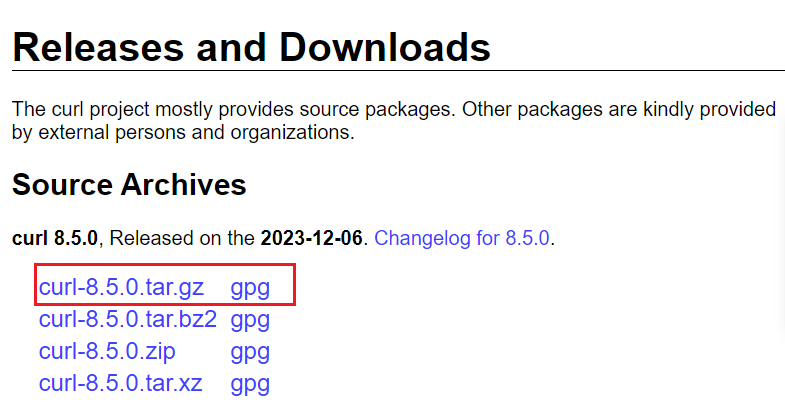

Requirements

1. Install Packages
1. Git Installation
2. Curl Installation 
3. Brew Installation

## Install Packages

```shell 
yum install -y epel-release 

yum install -y yum-utils htop iotop sysstat bind-utils wget 

yum groupinstall -y "Development Tools"

```

## Git Installation

If you're using centos 7 you need to upgrade curl and git version in order to install brew 

> In Centos 7 default git version will be 1.8.3.1

```shell 
git --version 

git version 1.8.3.1
```

you will need to remove this first

```shell 
sudo yum remove -y git && sudo yum remove -y git-*
```

Add Endpoint Repo Centos7 

```shell
sudo yum -y install https://packages.endpointdev.com/rhel/7/os/x86_64/endpoint-repo.x86_64.rpm
```

Install Git 

```shell
yum install -y git
```

to check git version you can use 

```shell
git --version
```

## Curl Installation

Same as above, curl version also need to update

you can check curl version with following command 

```shell
curl --version
```

default curl version will be 

```
curl 7.29.0 (x86_64-redhat-linux-gnu) libcurl/7.29.0 NSS/3.53.1 zlib/1.2.7 libidn/1.28 libssh2/1.8.0
Protocols: dict file ftp ftps gopher http https imap imaps ldap ldaps pop3 pop3s rtsp scp sftp smtp smtps telnet tftp
Features: AsynchDNS GSS-Negotiate IDN IPv6 Largefile NTLM NTLM_WB SSL libz unix-sockets
```

download latest curl https://curl.se/download.html



Install Developer Tools and GCC compiler packages 
```shell 
sudo yum install wget gcc openssl-devel make -y
```

Install Latest Curl 
```shell
wget https://curl.se/download/curl-8.5.0.tar.gz

tar -zxvf curl-8.5.0.tar.gz

cd curl-8.5.0/

./configure --prefix=/usr/local --with-ssl

sudo make && sudo make install

sudo ldconfig
```

## Brew Installation

```shell 
/bin/bash -c "$(curl -fsSL https://raw.githubusercontent.com/Homebrew/install/HEAD/install.sh)"
```

```
(echo; echo 'eval "$(/home/linuxbrew/.linuxbrew/bin/brew shellenv)"') >> /home/jacklin/.bashrc

eval "$(/home/linuxbrew/.linuxbrew/bin/brew shellenv)"
```
